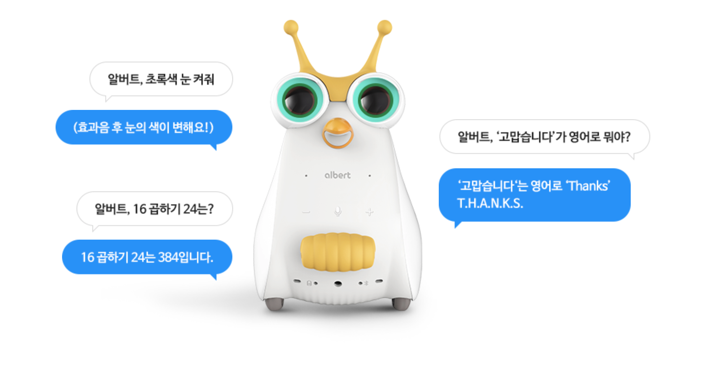

# 로봇 대화시스템 연구를 위한 소셜로봇 플랫폼 albert AI

2019년 10월, 아이의 코딩 학습을 도와주는 albert AI가 출시되었습니다. albert AI는 출시 이래로 유아 및 초등학생들의 IT 학습을 도와주기위해 개발되고 업데이트 되어 왔으며 이제는 NUGU 탑재를 바탕으로 사용자와 대화가 가능한 소셜로봇역할도 할 수 있게되었습니다.

목적
---
우리는 로봇과 함께 공존하는 시대에 살고 있습니다. 지금까지 컴퓨터와 소통하는 방법을 학습하여 우리의 삶에 유용하게 사용했듯, 앞으로는 로봇과의 소통방법이 중요 해 질 것 입니다. 이 프로젝트는 사람-로봇 상호작용에 관해 일반인부터 연구원까지 함께 고민하고 이에 필요한 도구와 환경을 제공하기 위해 작성되었습니다.
- albert AI는 완성형 하드웨어와 비개발자도 사용 가능한 저작도구를 제공함으로써 로봇대화시스템 연구에 보다 몰두 할 수 있습니다.
- 대화가 가능한 로봇이 필요한 곳에 albert AI를 활용해 보세요. 이 로봇은 사람의 말을 듣고 이해하며 알버트 목소리로 대답하고 공감합니다. 
- 로봇의 지능수준이 인간을 따라잡기에는 시간이 더 필요할 것 같습니다. 이 프로젝트로 HRI 연구에 유용하게 활용되길 희망합니다. 

특성
---
albert AI는 첨단기술이 집약된 하드웨어와 AI기술을 바탕으로 개발되었으며 사용자는 별도의 개발 혹은 코딩 없이 손쉽게 사용가능합니다. 
  

  
- 음성인식에 특화된 마이크보드와 음성인식(전처리, 학습, 인식)기술 
- ablert AI 전용 음성 호출어인 '알버트', 남자어린아이 음성 합성 제공
- 사용자의 자연어 요청을 이해하고 의도를 파악하여 정보를 제공하는 AI 시스템
- 6종 센서로 외부환경을 인지하고 스테핑모터로 정밀한 위치제어 가능
- 눈동자의 Full Color LED로 다양한 상태표현이 가능하며 3.5W 스피커로 고품질 음원재생 가능
- 모바일앱에서 간단하고 빠르게 나만의 대화 시나리오를 추가(My Q&A 기능)및 확인 가능
- 나만의 대화시스템을 손쉽게 구현하고 연구할 수 있는 NUGU play Builder(예정) 제공
- Backend proxy(REST API)로 나의 콘텐츠를 로봇과 연동하고 외부 서비스와 기기를 호출&응답 (예정)

활용방법
---
albert AI는 사람과 로봇 간의 소통이 필요한 다양한 상황에 빠르게 적용하고 테스트하여 검증해 볼 수 있습니다. 
- 예시1. 치매예방을 위한 말동무로봇의 대화 시나리오 연구 
- 예시2. 유아의 지능 및 언어 학습발달을 위한 교육 시나리오 연구
- 예시3. 매장에서 사람대신 응대하는 질의응답 시나리오 연구

주요기술
---

- Natural User Interface
   - Keyword Spotting, ASR, NLU, NLG, TTS
- Intelligence 
   - 검색 기술, 요약 기술, 통합 지식베이스, 추천 기술

대화시스템 저작도구
--
- 디바이스 컨트롤러 
   - Mobile App을 통해 ‘텍스트 명령’을 이용할 수 있습니다. 디바이스에 직접 음성명령을 내리는 것과 동일한 효과와 결과를 보여줍니다.
   - [디바이스 컨트롤러 사용방법](https://github.com/davincioh/SocialRobotPlatform_albertAI_DeviceController)
- My Q&A
   - Mobile App에서 나만의 음성 명령을 등록하여 로봇에서 즉시 확인할 수 있습니다.
   - [My Q&A 사용방법](https://github.com/davincioh/SocialRobotPlatform_albertAI_MyQA)
- NUGU 서비스 
   - 대화시나리오를 풍부하게 도와주는 NUGU 서비스 활용하기
   - [NUGU 서비스 사용방법](https://github.com/davincioh/SocialRobotPlatform_albertAI_NUGUService) 
- NUGU play Builder 
   - 대화시스템 통합 개발 환경을 GUI 기반으로 제공함으로써, 사용자들은 쉽게 자신들의 서비스를 개발할 수 있습니다. 
   - NUGU Play Builder 사용방법 (오픈예정)

관련자료
---
- [albert AI 제품메뉴얼](https://www.nugu.co.kr/static/nugu_albert/)
- [NUGU 기술자료](https://www.slideshare.net/NUGU_developers?utm_campaign=profiletracking&utm_medium=sssite&utm_source=ssslideview)

